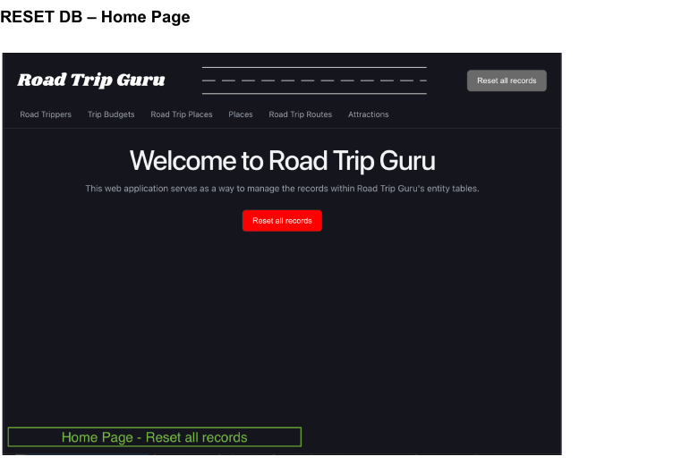
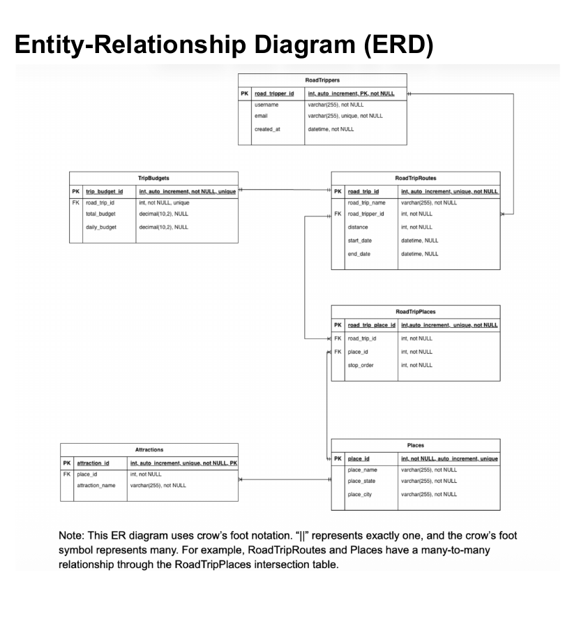
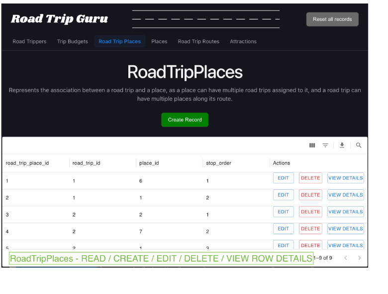

# Road Trip Guru

Road Trip Guru is a database-driven web application for managing road trips, destinations, attractions, stop order, and budget information. It was developed as the team project for Oregon State University CS 340: Introduction to Databases.

## Team

- Feifan Qi
- Daniella Norris

The database design, project-specific SQL, frontend and backend integration, testing, and project documentation were completed collaboratively. Individual contribution details can be added after both contributors confirm the final public description.

## Project overview

The application provides a web interface over a relational MySQL/MariaDB database. Its main purpose is to demonstrate database modeling and data-management operations rather than serve as a production travel-planning service.



### Implemented operations

- View records for all six entities.
- Create road trippers, attractions, road-trip routes, and trip/place relationships.
- Update and delete road-trip routes and `RoadTripPlaces` relationships.
- Delete attractions.
- View individual record details.
- Reset the schema and reload sample data through a stored procedure.

## Database design

The database contains six tables:

- `RoadTrippers`
- `RoadTripRoutes`
- `TripBudgets`
- `Places`
- `RoadTripPlaces`
- `Attractions`

`RoadTripPlaces` is the intersection table between `RoadTripRoutes` and `Places`. It implements the many-to-many relationship and stores the order in which destinations are visited.



The physical MySQL schema is available in [docs/schema.png](docs/schema.png). SQL definitions, sample data, and stored procedures are located in [`database/`](database/).

## Technology

- React and Vite
- Material UI and MUI Data Grid
- Node.js and Express
- MySQL/MariaDB with `mysql2`
- Docker Compose for a reproducible local database

## Run locally

### Prerequisites

- Node.js 20 or newer
- Docker Desktop with Docker Compose

### 1. Configure the project

Copy the example environment files:

```bash
cp .env.example .env
cp backend/.env.example backend/.env
cp frontend/.env.example frontend/.env
```

The included development values are intended only for a local Docker database. Do not commit real credentials.

### 2. Start the database

```bash
docker compose up -d
```

On first start, MariaDB loads the schema, sample data, reset procedure, and CRUD procedures from [`database/`](database/).

### 3. Start the backend

```bash
cd backend
npm install
npm run development
```

The API runs at `http://localhost:3001` by default.

### 4. Start the frontend

In another terminal:

```bash
cd frontend
npm install
npm run development
```

Open `http://localhost:5175`.

## Demonstrated many-to-many workflow

The `RoadTripPlaces` screen supports create, read, update, delete, and detail views for the relationship between trips and destinations.



## School-hosted version

The original course deployment was hosted at `classwork.engr.oregonstate.edu:3212` and may require Oregon State University VPN access. The public repository is configured for local execution so the restricted course server is not required.

## Project structure

```text
road-trip-guru/
├── backend/              Express API and database connector
├── database/             Schema, seed data, and stored procedures
├── docs/                 Diagrams, screenshots, and course summary
├── frontend/             React user interface
├── .env.example          Local database defaults
└── docker-compose.yml    Reproducible local MariaDB service
```

## Development history

The course project progressed from requirements and ER modeling through SQL implementation and full-stack integration. A curated milestone summary is available in [docs/project-evolution.md](docs/project-evolution.md). Earlier course-submission ZIP files are intentionally not included because they duplicate the final source.

## Documentation and attribution

- [Executive summary](docs/executive-summary.pdf)
- [Project evolution](docs/project-evolution.md)
- [AI assistance disclosure](docs/ai-assistance.md)

Course materials and official documentation for React, Vite, Express, Material UI, MUI Data Grid, and MySQL/MariaDB were consulted during development. AI-assisted portions are documented rather than presented as unaided work.

## License

No open-source license has been selected. Both contributors should agree on a license before third-party reuse is permitted.
